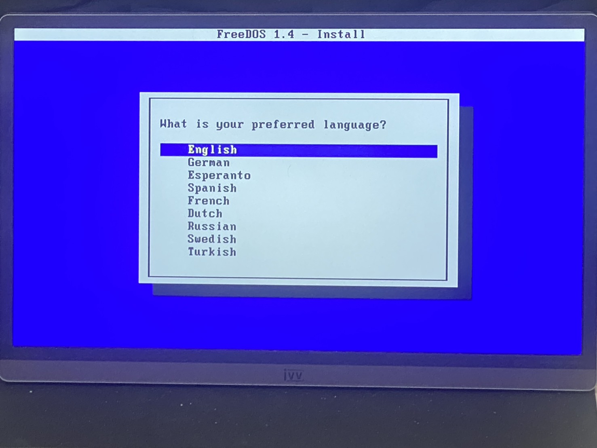
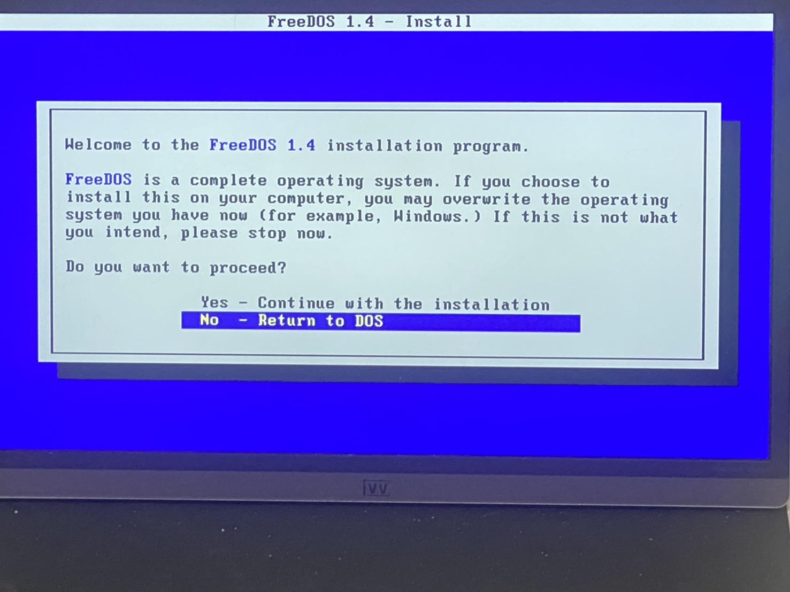
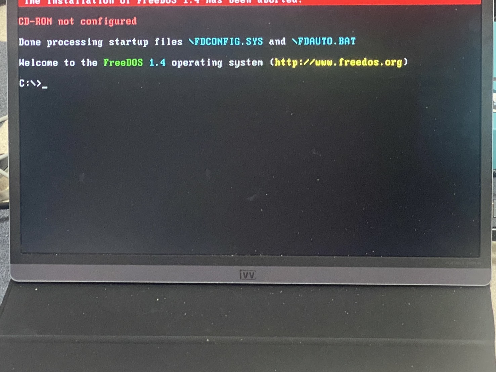

# PRIMERGY TX1310 m3 BIOS UPDATE

## 1. 目的

PRIMERGY TX1310 m3のBIOSをアップデートするのに手間取ったので、まとめておく

## 2. ライセンスなど

MITライセンスです  
サンプルソースなど使用していただくのは構いませんが、いかなる責任も負いません  
すべて自己責任でお願いいたします

## 3. FreeDOSのBootable USBの作成

オンラインアップデートを行うのはどうも、Windows、Linuxの特定のバージョンでしか行えないようだ  
色々ごにょればできるかもしれないが、BIOSのアップデートなのであまりそういったことはしないでおく  
以下に、オフラインアップデートの方法を記述する

### 3-1. 準備

[PRIMERGY BIOS/ファームウェア](https://jp.fujitsu.com/platform/server/primergy/bios/)のサイトから該当のモデルを選択し、オフラインアップデートツールをクリックし、  
遷移した先のサイトから、「カートに入れず直接ダウンロードする」を選択後一番下までスクロールさせ、  
「ファイルをダウンロードする」をクリック  
ダウンロードしたzipファイルを展開する  

### 3-2. WindowsでのBootable USBの作成

BootしたいUSBを挿入してFATでフォーマットしておき、展開したフォルダ内にある、  
FTS_Bootstick〜.exeをクリックすると、挿入したUSBが表示されるので、backupのチェックを外したのちFormatをクリック  
何事もなければフォーマットが完了し、FreeDOSが起動できる状態になる  
あとは、必要なファイル(多分DOSフォルダ)をUSB内にコピーすればよい

### 3-3. LinuxでのBootable USBの作成

普段はLinuxを使用していることの方が圧倒的に多いため、本題はこちら。  
[FreeDOS](https://www.freedos.org)のサイトから[ダウンロード](https://www.freedos.org/download)を開いて、FullUSBをダウンロードして展開する  

BootさせたいUSBを挿入し、以下を実行
```
# fdisk -l
```
で、対象となるUSBメモリを確認
```
# dd if=/dev/zero of=/dev/sdX bs=1M status=progress
```
で、USBを初期化(sdXのXはfdiskの結果で確認したもの)  
次に、以下のコマンドでFreeDOSのダウンロードファイルを展開してできる、FDXXFULL.imgを書き込む(XXはバージョン番号)
```
# dd if=FDXXFULL.img of=/dev/sdX bs=1M status=progress
```
書込完了後、再度fdiskで確認
```
# fdisk -l
```
このとき、書き込んだUSBに/dev/sdX1があることを確認し、マウント
```
# mount /dev/sdX1 /mnt
```
マウントしたら、BIOS側の展開したフォルダから必要なファイル(多分DOSフォルダ)をコピー
```
# cp -rp /xxxx/xxxx/xxxx/DOS /mnt
```
コピーしたらアンマウント
```
# umount /mnt
```
これで準備は完了です

## 4. Bootable USBの起動

PRIMERGY TX1310 m3のBIOS画面を起動しAdvancedタブの  
1. CSM ConfigurationのLaunch CSMをEnabledにして、現れた項目の値はすべてLegacy only
2. USB ConfigurationのLegacy USB SupportがEnabledになっていることを確認

この状態でBIOSの設定を保存して、Bootの順番で作成したUSBを選択  
WindowsでUSBを作成した場合は起動後そのままプロンプトになるが、LinuxでUSBを作成した場合はFreeDOSのインストーラが立ち上がって、言語の選択を促されるので、Englishを選択したのち、インストールを続けるかどうかのメッセージが出るので、「No」を選択してDOSの画面に戻る

LinuxでBootable USBを起動した場合

インストーラがまず起動し、言語の選択


DOSに戻るため、「No」を選択


DOSに戻るとこんな画面


## 5. BIOS UPDATE

以下のコマンドを実行
```dos
> cd dos
> dosflash.bat
> continue Flash Update? (y/n) ← yを押下
```

## 6. 参考にしたサイト

* [TX1310 M3のBIOSファームウェアをアップデート](https://paso.iroiro.jp/item/229.html)
* [富士通 PRIMERGY TX1310 M3 BIOSアップデート完了](https://www.024m2.com/article/201905article_7.html)
* [富士通PRIMERGYシリーズのBIOS/ファームウェアをアップデート！](https://minory.org/primergy-bios-update.html)
* [LinuxからBIOSを書き換える](https://wiki.archlinux.jp/index.php/Linux_%E3%81%8B%E3%82%89_BIOS_%E3%82%92%E6%9B%B8%E3%81%8D%E6%8F%9B%E3%81%88%E3%82%8B)